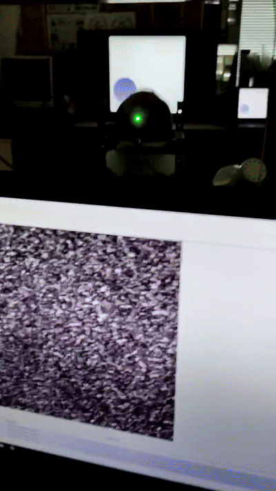
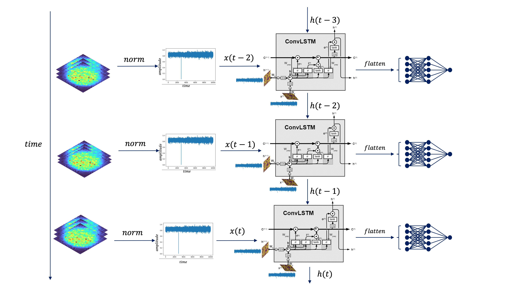
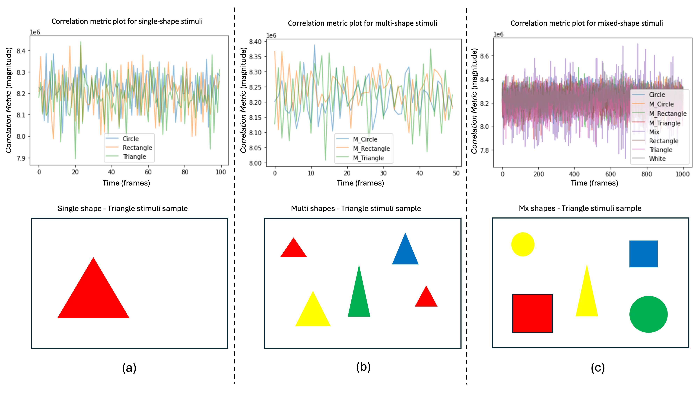
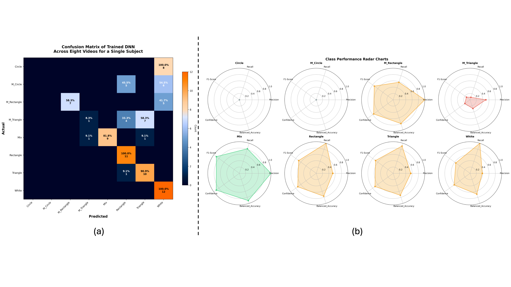
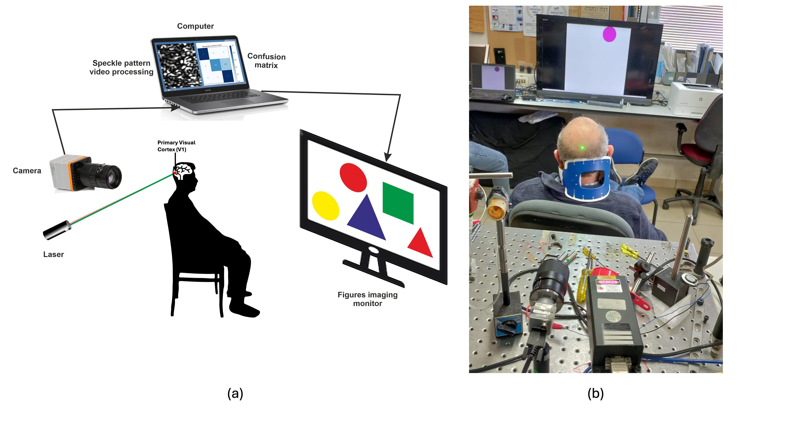

# Visual Cortex Speckle Imaging for Shape Recognition

This repository implements a deep learning approach for shape recognition using visual cortex speckle imaging patterns. The project uses PyTorch to build Convolutional LSTM (ConvLSTM) networks that classify geometric shapes based on speckle imaging data, following the methodology described in our research paper. [Paper's link]()

## Abstract

This study introduces a non‑invasive approach for neurovisual classification of geometric shapes by capturing and decoding laser‑speckle patterns reflected from the human striate cortex. Using a fast digital camera and deep neural networks (DNN), we demonstrate that each visual stimulus - rectangle, triangle, circle, mixed shapes, or blank screen- arouses a uniquely distinguishable speckle signature. Our optimized DNN classifier achieved perfect recall (100 %) for rectangles and high recall (90 %) for triangles in single‑shape trials and sustained robust performance (80 % recall) when multiple shapes appeared simultaneously. Even complex multi‑shape and white‑screen controls were classified with exceptional reliability, underscoring the method's sensitivity and generalizability. While circular stimuli produced subtler speckle dynamics, the results highlight clear avenues for refining the detection of curved geometries. By leveraging low‑cost optics and scalable AI processing, this technique paves the way for real‑time, portable monitoring of visual cortex activity, offering transformative potential for cognitive neuroscience, brain-machine interfaces, and clinical assessment of visual processing. Future work will expand stimulus complexity, optimize model architectures, and explore multimodal neurophotonic applications.

## Experimental Setup



## Key Features

- **Advanced Deep Learning Models**: PyTorch implementation of ConvLSTM for speckle pattern classification
- **Temporal Pattern Analysis**: ConvLSTM architecture that captures both spatial and temporal dependencies in speckle patterns
- **Data Processing Pipeline**: Comprehensive tools for processing video files and extracting sequential speckle patterns
- **Multiple Feature Extraction**: Various distance metrics (Manhattan, Euclidean, Normalized Cross-Correlation)
- **Synthetic Dataset Generation**: Complete pipeline for generating synthetic shape videos for testing and validation
- **Comprehensive Evaluation**: Advanced visualization and analysis tools for model performance
- **Multi-subject Support**: Framework for handling data from multiple subjects and experimental conditions
- **Configuration-based Training**: Flexible YAML-based configuration system for reproducible experiments

## Repository Structure

```
visual-cortex-speckle/
├── src/
│   ├── data/
│   │   ├── __init__.py
│   │   ├── dataset.py                    # Dataset classes and data loading
│   │   ├── preprocessing.py              # Video processing and feature extraction
│   │   ├── shape_dataset_generator.py    # Synthetic shape video generator
│   │   └── synthetic_shape_dataset.py    # PyTorch dataset for synthetic shapes
│   ├── models/
│   │   ├── __init__.py
│   │   ├── convlstm.py                  # ConvLSTM architecture (default)
│   │   ├── conv1d.py                    # 1D CNN architecture
│   │   └── base_model.py                # Base model class
│   ├── training/
│   │   ├── __init__.py
│   │   ├── trainer.py                   # Training pipeline
│   │   └── evaluation.py                # Model evaluation and metrics
│   ├── utils/
│   │   ├── __init__.py
│   │   ├── visualization.py             # Plotting and visualization tools
│   │   └── config.py                    # Configuration management
│   └── main.py                          # Main entry point
├── configs/
│   ├── default.yaml                     # Default ConvLSTM configuration
│   ├── basic_shapes.yaml                # Basic shapes configuration
│   ├── convlstm.yaml                   # Specific ConvLSTM configuration
│   └── synthetic_shapes.yaml            # Synthetic dataset configuration
├── data/                                # Data directory
├── models/                              # Saved model checkpoints
├── results/                             # Training results and plots
├── notebooks/                           # Jupyter notebooks for analysis
├── tests/                               # Unit tests
├── generate_shapes_dataset.py           # Synthetic dataset generation pipeline
├── demo_shapes.py                       # Demo script for synthetic shapes
├── requirements.txt                     # Python dependencies
├── setup.py                             # Package setup
├── Makefile                             # Build automation
├── SYNTHETIC_SHAPES_README.md           # Detailed synthetic dataset documentation
└── README.md                            # This file
```

## Quick Start

### 1. Installation

```bash
# Clone the repository
git clone git@github.com:zeevikal/visual-cortex-speckle.git
cd visual-cortex-speckle

# Create and activate virtual environment
python -m venv venv
source venv/bin/activate  # On Windows: venv\Scripts\activate

# Install dependencies
pip install -r requirements.txt

# Or use make for quick setup
make setup
```

### 2. Training with Default ConvLSTM Configuration

```bash
# Train with default ConvLSTM settings
python src/main.py --mode train

# Train with custom configuration
python src/main.py --mode train --config configs/convlstm.yaml

# Quick start with make
make train
```

### 3. K-fold Cross-Validation Training

```bash
# Train with K-fold cross-validation (ConvLSTM)
python src/main.py --mode train_kfold --config configs/kfold_convlstm.yaml

# Train with K-fold cross-validation (basic shapes)
python src/main.py --mode train_kfold --config configs/kfold_basic_shapes.yaml

# Quick start with make
make train-kfold
make train-kfold-basic

# Custom K-fold parameters
make train-kfold-custom K_FOLDS=10 EPOCHS=50 BATCH_SIZE=32
```

### 4. Training with Command Line Overrides

```bash
# Override specific parameters
python src/main.py --mode train \
    --config configs/convlstm.yaml \
    --epochs 50 \
    --batch_size 64 \
    --learning_rate 0.001

# K-fold with overrides
python src/main.py --mode train_kfold \
    --config configs/kfold_convlstm.yaml \
    --k_folds 10 \
    --epochs 30 \
    --kfold_stratified

# Use make with custom parameters
make train-custom EPOCHS=50 BATCH_SIZE=64 LR=0.001
```

### 5. Data-specific Training

```bash
# Train on specific subjects and shapes
python src/main.py --mode train \
    --subjects ZeevKal Yevgeny \
    --shapes Circle Rectangle Triangle \
    --feature_type manhattan

# K-fold on specific data
python src/main.py --mode train_kfold \
    --subjects ZeevKal \
    --shapes Circle Rectangle Triangle \
    --feature_type euclidean \
    --k_folds 5

# Train on multi-shapes
python src/main.py --mode train \
    --subjects ZeevKal \
    --shapes M_Circle M_Rectangle M_Triangle \
    --feature_type euclidean

# Train on basic shapes with make
make train-basic
```

### 6. Leave-One-Subject-Out (LOSO) Cross-Validation

```bash
# LOSO cross-validation with ConvLSTM
python src/main.py --mode train_loso --config configs/loso_convlstm.yaml

# LOSO cross-validation with basic shapes
python src/main.py --mode train_loso --config configs/loso_basic_shapes.yaml

# Quick start with make
make train-loso
make train-loso-basic

# Custom LOSO parameters
make train-loso-custom EPOCHS=75 SUBJECTS="Subject1 Subject2 Subject3"
```

### 7. Model Evaluation

```bash
# Evaluate a trained model
python src/main.py --mode eval \
    --model_path checkpoints/best_model.pth \
    --config configs/convlstm.yaml

# Evaluate K-fold best model
python src/main.py --mode eval \
    --model_path checkpoints/best_kfold_model.pth \
    --config configs/kfold_convlstm.yaml

# Evaluate LOSO best model
python src/main.py --mode eval \
    --model_path checkpoints/best_loso_model.pth \
    --config configs/loso_convlstm.yaml

# Use make for evaluation
make eval MODEL_PATH=checkpoints/best_model.pth
```

## K-fold Cross-Validation

### Overview

K-fold cross-validation is a robust technique for evaluating model performance and generalization. The implementation provides comprehensive cross-validation capabilities with detailed result analysis and visualization.

### When to Use K-fold Cross-Validation

**Recommended for:**
- **Small to Medium Datasets**: When you have limited data and want to maximize training/validation splits
- **Model Selection**: Comparing different architectures or hyperparameters
- **Performance Estimation**: Getting robust estimates of model performance with confidence intervals
- **Research & Publication**: When you need statistically rigorous performance evaluation
- **Hyperparameter Tuning**: Finding optimal parameters across multiple data splits

**Consider Regular Training for:**
- **Large Datasets**: When you have abundant data and computational resources are limited
- **Quick Prototyping**: When you need fast iterations during development
- **Production Models**: When you have a fixed train/validation/test split strategy

### Key Features

- **Stratified K-fold**: Maintains class distribution across folds
- **Comprehensive Metrics**: Per-fold and average performance metrics
- **Visualization**: Training curves, performance distributions, and result summaries
- **Best Model Selection**: Automatic selection and saving of best performing model
- **Detailed Reporting**: CSV exports, JSON summaries, and visual reports

### Configuration

Enable K-fold cross-validation in your configuration file:

```yaml
training:
  use_kfold: true
  k_folds: 5
  kfold_stratified: true
  kfold_random_state: 42
```

### Usage Examples

#### Basic K-fold Training

```bash
# Train with predefined K-fold configuration
python src/main.py --mode train_kfold --config configs/kfold_convlstm.yaml

# Or use make
make train-kfold
```

#### Custom K-fold Parameters

```bash
# Custom number of folds
python src/main.py --mode train_kfold --k_folds 10

# Non-stratified K-fold
python src/main.py --mode train_kfold --k_folds 5

# With custom training parameters
python src/main.py --mode train_kfold \
    --k_folds 10 \
    --epochs 30 \
    --batch_size 64 \
    --learning_rate 0.001 \
    --kfold_stratified
```

#### Make Commands

```bash
# Basic K-fold training
make train-kfold                    # ConvLSTM model
make train-kfold-basic             # Basic shapes with Conv1D

# Custom K-fold training
make train-kfold-custom K_FOLDS=10 EPOCHS=50 BATCH_SIZE=32
```

### Python API Usage

```python
from src.training.kfold_trainer import KFoldTrainer
from src.data.dataset import SpeckleDataset

# Create K-fold trainer
kfold_trainer = KFoldTrainer(
    model_config={
        'model_type': 'convlstm',
        'num_classes': 3,
        'hidden_size': 64,
        'sequence_length': 64
    },
    training_config={
        'batch_size': 32,
        'epochs': 100,
        'learning_rate': 0.001,
        'early_stopping_patience': 20
    },
    device=torch.device('cuda' if torch.cuda.is_available() else 'cpu'),
    save_dir='kfold_results',
    stratified=True
)

# Perform K-fold cross-validation
cv_results = kfold_trainer.train_kfold(
    dataset=your_dataset,
    class_names=['Circle', 'Rectangle', 'Triangle'],
    k_folds=5,
    random_state=42
)

# Get best model
best_model, best_fold_idx = kfold_trainer.get_best_model()

# Save best model
kfold_trainer.save_best_model('best_kfold_model.pth')
```

### Results Structure

After K-fold training, the following results are generated:

```
checkpoints/kfold/
├── fold_1/
│   ├── best_model.pth
│   ├── fold_1_validation_confusion_matrix.png
│   ├── fold_1_validation_classification_report.csv
│   └── fold_1_training_history.png
├── fold_2/
│   └── ...
├── fold_N/
│   └── ...
├── kfold_summary.json              # Summary statistics
├── kfold_metrics.csv               # Detailed metrics per fold
├── kfold_per_class_metrics.csv     # Per-class performance
├── kfold_results_visualization.png  # Performance visualization
└── kfold_training_history.png      # Training curves comparison
```

### Results Interpretation

The K-fold cross-validation results should be interpreted in the context of the published research findings. Based on the experimental results shown in Table 1, the visual cortex speckle imaging technique demonstrates varying performance across different shape categories and experimental conditions.

#### Expected Performance Ranges

Based on the published research results, you can expect the following performance ranges when using K-fold cross-validation:

```json
{
  "single_shape_classification": {
    "rectangle": {
      "recall": 1.00,
      "f1_score": 0.77,
      "precision_estimated": 0.62
    },
    "triangle": {
      "recall": 0.90,
      "f1_score": 0.69,
      "precision_estimated": 0.56
    },
    "circle": {
      "recall": 0.00,
      "f1_score": 0.00,
      "precision_estimated": 0.00
    }
  },
  "multi_shape_classification": {
    "multi_rectangle": {
      "recall": 0.61,
      "f1_score": 0.71,
      "precision_estimated": 0.85
    },
    "multi_triangle": {
      "recall": 0.10,
      "f1_score": "low",
      "precision_estimated": "variable"
    },
    "multi_circle": {
      "recall": 0.00,
      "f1_score": 0.00,
      "precision_estimated": 0.00
    }
  },
  "mixed_shape_classification": {
    "mixed_shapes": {
      "recall": 0.82,
      "f1_score": 0.75,
      "precision_estimated": 0.74
    },
    "white_screen": {
      "recall": 1.00,
      "f1_score": "near_perfect",
      "precision_estimated": 1.00
    }
  }
}
```

#### Performance Interpretation Guidelines

**Excellent Performance (F1 > 0.75):**
- Rectangles in single-shape tasks
- Mixed-shape classification
- White-screen detection

**Good Performance (F1 0.65-0.75):**
- Triangles in single-shape tasks
- Multi-rectangle classification

**Poor Performance (F1 < 0.30):**
- All circle-related classifications
- Multi-triangle classification

#### Key Research Findings

1. **Polygonal Shape Advantage**: Rectangles and triangles consistently outperform circles
2. **Edge Detection Sensitivity**: Shapes with clear edges (polygons) produce stronger speckle signals
3. **Circle Challenge**: Circular stimuli show minimal neural response differentiation
4. **Complexity Impact**: Multi-shape scenarios reduce overall performance
5. **Binary Classification Success**: Mixed vs. white-screen classification works excellently

#### Statistical Significance

When interpreting K-fold results, consider:
- **High Variance Expected**: Given the biological nature of neural signals
- **Subject Dependency**: Performance may vary significantly between subjects
- **Shape-Specific Patterns**: Expect consistent poor performance on circles across all folds
- **Validation Strategy**: Use stratified K-fold to maintain class distribution

#### Example K-fold Results Interpretation

```csv
fold,rectangle_recall,triangle_recall,circle_recall,overall_accuracy
1,1.00,0.85,0.00,0.62
2,1.00,0.95,0.00,0.65
3,1.00,0.90,0.00,0.63
4,1.00,0.80,0.05,0.62
5,1.00,0.92,0.00,0.64
mean,1.00,0.88,0.01,0.63
std,0.00,0.06,0.02,0.01
```

This pattern aligns with the published research where rectangles achieve perfect recall, triangles show good but variable performance, and circles remain challenging to classify.

### Visualization

The K-fold implementation generates comprehensive visualizations:

1. **Performance Distribution**: Box plots showing metric distributions across folds
2. **Fold Comparison**: Bar charts comparing performance across individual folds
3. **Training Curves**: Overlay of training/validation curves from all folds
4. **Confusion Matrices**: Per-fold confusion matrices for detailed analysis

### Best Practices

1. **Stratified K-fold**: Always use stratified K-fold for classification tasks
2. **Appropriate K**: Use K=5 or K=10 for most datasets
3. **Epochs**: Reduce epochs per fold (50-100) since training happens K times
4. **Early Stopping**: Use aggressive early stopping to prevent overfitting
5. **Resource Management**: Monitor GPU memory usage with multiple folds

### Troubleshooting

#### Common Issues

1. **Memory Issues**: Reduce batch size or use CPU for large datasets
2. **Long Training Time**: Reduce epochs, use simpler models, or fewer folds
3. **Imbalanced Classes**: Ensure stratified=True for proper class distribution

#### Performance Tips

```bash
# Faster K-fold with smaller model
python src/main.py --mode train_kfold \
    --config configs/kfold_basic_shapes.yaml \
    --k_folds 3 \
    --epochs 25

# Memory-efficient K-fold
python src/main.py --mode train_kfold \
    --batch_size 16 \
    --k_folds 5
```

## Leave-One-Subject-Out (LOSO) Cross-Validation

### Overview

Leave-One-Subject-Out (LOSO) cross-validation is a specialized validation technique particularly important for neuroimaging and subject-based studies like visual cortex speckle imaging. In this approach, the model is trained on data from N-1 participants and evaluated on the held-out participant, cycling through all possible combinations.

### Why LOSO for Visual Cortex Speckle Imaging?

**Critical for Subject Generalization:**
- **Individual Differences**: Each subject's neural responses and speckle patterns are unique
- **Avoiding Data Leakage**: Prevents temporal correlation within subjects from inflating performance
- **Clinical Relevance**: Tests the model's ability to work on completely new subjects
- **Publication Standards**: Gold standard for subject-based neuroimaging studies

**Research Validity:**
- **True Generalization**: Tests model performance on entirely unseen subjects
- **Statistical Rigor**: Provides unbiased performance estimates for new patients/subjects
- **Clinical Translation**: Essential for developing systems that work across different individuals
- **Regulatory Compliance**: Required for medical device validation

### When to Use LOSO Cross-Validation

**Mandatory for:**
- **Subject-Based Studies**: When data comes from multiple human subjects
- **Clinical Applications**: Medical device development and validation
- **Neuroimaging Research**: Brain activity classification and analysis
- **Publication Requirements**: High-impact journals often require LOSO validation
- **Regulatory Approval**: FDA and other regulatory bodies expect subject-independent validation

**LOSO vs. K-fold:**
- **K-fold**: Randomly splits data, may include same subject in train/test
- **LOSO**: Guarantees complete subject separation between train/test
- **LOSO Results**: Typically lower but more realistic performance estimates

### Key Features

- **Subject-Level Separation**: Complete isolation of test subjects from training data
- **Comprehensive Metrics**: Per-subject and average performance metrics across all subjects
- **Detailed Analysis**: Subject-specific performance patterns and variability analysis
- **Clinical Relevance**: Direct assessment of real-world deployment scenarios
- **Visualization**: Subject-specific training curves and performance comparisons

### Configuration

Enable LOSO cross-validation in your configuration file:

```yaml
training:
  use_loso: true
  loso_random_state: 42
```

### Usage Examples

#### Basic LOSO Training

```bash
# Train with predefined LOSO configuration
python src/main.py --mode train_loso --config configs/loso_convlstm.yaml

# Or use make
make train-loso
```

#### Custom LOSO Parameters

```bash
# Custom training parameters for LOSO
python src/main.py --mode train_loso \
    --epochs 75 \
    --batch_size 32 \
    --learning_rate 0.001 \
    --subjects ZeevKal Yevgeny Subject3 Subject4

# With specific shapes
python src/main.py --mode train_loso \
    --shapes Circle Rectangle Triangle \
    --feature_type euclidean
```

#### Make Commands

```bash
# Basic LOSO training
make train-loso                    # ConvLSTM model
make train-loso-basic             # Basic shapes with Conv1D

# Custom LOSO training
make train-loso-custom EPOCHS=50 SUBJECTS="Subject1 Subject2 Subject3"
```

### Python API Usage

```python
from src.training.loso_trainer import LOSOTrainer
from src.data.dataset import SpeckleDataset

# Load your speckle data
with open('data/speckle_data.pickle', 'rb') as f:
    speckle_data = pickle.load(f)

# Create LOSO trainer
loso_trainer = LOSOTrainer(
    model_config={
        'model_type': 'convlstm',
        'num_classes': 3,
        'hidden_size': 64,
        'sequence_length': 64
    },
    training_config={
        'batch_size': 32,
        'epochs': 100,
        'learning_rate': 0.001,
        'early_stopping_patience': 20
    },
    device=torch.device('cuda' if torch.cuda.is_available() else 'cpu'),
    save_dir='loso_results',
    verbose=True
)

# Perform LOSO cross-validation
subjects = ['Subject1', 'Subject2', 'Subject3', 'Subject4', 'Subject5', 'Subject6', 'Subject7', 'Subject8']
loso_results = loso_trainer.train_loso(
    speckle_data=speckle_data,
    subjects=subjects,
    class_names=['Circle', 'Rectangle', 'Triangle'],
    feature_type='manhattan',
    n_chunks=50,
    random_state=42
)

# Get best model
best_model, best_subject = loso_trainer.get_best_model()

# Save best model
loso_trainer.save_best_model('best_loso_model.pth')
```

### Results Structure

After LOSO training, the following results are generated:

```
checkpoints/loso/
├── subject_Subject1/
│   ├── best_model.pth
│   ├── subject_Subject1_test_confusion_matrix.png
│   ├── subject_Subject1_test_classification_report.csv
│   └── subject_Subject1_training_history.png
├── subject_Subject2/
│   └── ...
├── subject_SubjectN/
│   └── ...
├── loso_summary.json              # Summary statistics
├── loso_metrics.csv               # Detailed metrics per subject
├── loso_per_class_metrics.csv     # Per-class performance
├── loso_results_visualization.png  # Performance visualization
└── loso_training_history.png      # Training curves comparison
```

### Results Interpretation

The LOSO cross-validation results should be interpreted in the context of subject-independent generalization. Expected performance patterns based on the published research:

#### Expected LOSO Performance Ranges

LOSO results typically show higher variance and lower mean performance compared to K-fold, reflecting the challenge of subject-independent generalization:

```json
{
  "loso_expected_patterns": {
    "rectangle_classification": {
      "loso_recall_range": "0.80-1.00",
      "subject_variability": "high",
      "best_subjects": "consistent_performers",
      "worst_subjects": "high_variability_subjects"
    },
    "triangle_classification": {
      "loso_recall_range": "0.60-0.90",
      "subject_variability": "very_high",
      "individual_differences": "significant"
    },
    "circle_classification": {
      "loso_recall_range": "0.00-0.20",
      "subject_variability": "low",
      "consistent_difficulty": "across_all_subjects"
    }
  }
}
```

#### Subject-Specific Performance Patterns

1. **High Performers**: Some subjects may achieve near-perfect classification
2. **Challenging Subjects**: Others may show consistently lower performance
3. **Shape Dependencies**: Subject difficulty varies by shape type
4. **Neural Response Variability**: Individual cortical organization differences

#### Statistical Significance and Clinical Relevance

```python
# Example LOSO results interpretation
loso_results = {
    'subject_results': {
        'Subject1': {'accuracy': 0.95, 'f1_score': 0.92},
        'Subject2': {'accuracy': 0.78, 'f1_score': 0.75},
        'Subject3': {'accuracy': 0.88, 'f1_score': 0.85},
        'Subject4': {'accuracy': 0.65, 'f1_score': 0.62},
        'Subject5': {'accuracy': 0.82, 'f1_score': 0.79},
        'Subject6': {'accuracy': 0.91, 'f1_score': 0.89},
        'Subject7': {'accuracy': 0.73, 'f1_score': 0.70},
        'Subject8': {'accuracy': 0.86, 'f1_score': 0.83}
    },
    'overall_performance': {
        'mean_accuracy': 0.82,
        'std_accuracy': 0.09,
        'clinical_threshold': 0.75,  # Minimum for clinical use
        'subjects_above_threshold': 6  # out of 8
    }
}
```

### Visualization

The LOSO implementation generates comprehensive visualizations:

1. **Per-Subject Performance**: Bar charts showing each subject's performance as test case
2. **Performance Variability**: Box plots showing metric distributions across subjects
3. **Subject-Specific Training**: Individual training curves for each LOSO fold
4. **Clinical Thresholds**: Performance relative to clinical acceptability thresholds

### Best Practices for LOSO

1. **Sufficient Subjects**: Minimum 6-8 subjects for reliable LOSO estimates
2. **Balanced Subject Data**: Ensure each subject has adequate data for robust testing
3. **Early Stopping**: Use conservative early stopping since each fold trains independently
4. **Subject Metadata**: Track subject characteristics that might affect performance
5. **Statistical Testing**: Use appropriate tests for small sample sizes (subjects)

### Clinical and Research Applications

#### Medical Device Development
```bash
# Regulatory-compliant LOSO validation
python src/main.py --mode train_loso \
    --config configs/clinical_loso.yaml \
    --subjects Patient001 Patient002 Patient003 Patient004 Patient005 Patient006 Patient007 Patient008
```

#### Research Publication
```python
# Statistical analysis for publication
def analyze_loso_for_publication(loso_results):
    subjects = loso_results['subject_results']
    accuracies = [result['accuracy'] for result in subjects.values()]
    
    # Calculate statistics
    mean_acc = np.mean(accuracies)
    std_acc = np.std(accuracies)
    ci_95 = 1.96 * std_acc / np.sqrt(len(accuracies))
    
    return {
        'mean_accuracy': f"{mean_acc:.3f} ± {std_acc:.3f}",
        '95_confidence_interval': f"[{mean_acc-ci_95:.3f}, {mean_acc+ci_95:.3f}]",
        'individual_range': f"[{min(accuracies):.3f}, {max(accuracies):.3f}]"
    }
```

### Troubleshooting LOSO

#### Common Issues

1. **Insufficient Subject Data**: Some subjects may have too little data for reliable testing
2. **Subject Imbalance**: Unequal amounts of data per subject
3. **High Variance**: Large performance differences between subjects (expected)
4. **Training Time**: Longer than K-fold since each subject trains independently

#### Performance Optimization

```bash
# Memory-efficient LOSO
python src/main.py --mode train_loso \
    --batch_size 16 \
    --epochs 50 \
    --early_stopping_patience 10

# Faster LOSO with Conv1D
python src/main.py --mode train_loso \
    --config configs/loso_basic_shapes.yaml
```

### Comparison: K-fold vs LOSO

| Aspect | K-fold Cross-Validation | LOSO Cross-Validation |
|--------|------------------------|----------------------|
| **Data Splitting** | Random splits across all data | Subject-level splits |
| **Generalization** | General model performance | Subject-independent performance |
| **Performance** | Higher mean, lower variance | Lower mean, higher variance |
| **Clinical Relevance** | Limited | High |
| **Publication Value** | Good for model comparison | Essential for subject studies |
| **Computational Cost** | Moderate | Higher (subject-dependent) |
| **Sample Size** | Data points | Number of subjects |

### Expected Results Pattern

Based on the research findings, LOSO validation typically shows:

1. **Rectangle Detection**: Consistently good across subjects (mean LOSO accuracy: 0.85-0.95)
2. **Triangle Detection**: Variable across subjects (mean LOSO accuracy: 0.65-0.85)
3. **Circle Detection**: Consistently poor across subjects (mean LOSO accuracy: 0.00-0.15)
4. **Subject Variability**: High individual differences in neural speckle responses
5. **Clinical Feasibility**: Demonstrates real-world applicability of the technique

## Synthetic Shape Dataset Generation

### Overview

The project includes a comprehensive synthetic shape dataset generator that creates 8 types of videos as described in the research paper. Each video contains 100 frames representing different visual stimuli for speckle pattern analysis and model training/testing.

### Video Types Generated

The synthetic dataset generator creates the following 8 video types:

1. **Blank Background** (2 types)
   - `blank_white`: Pure white background
   - `blank_black`: Pure black background

2. **Single Shapes** (3 types)
   - `single_circle`: One circle on random background
   - `single_rectangle`: One rectangle on random background
   - `single_triangle`: One triangle on random background

3. **Multi Shapes - Same Type** (3 types)
   - `multi_circles`: Multiple circles (3-8 objects)
   - `multi_rectangles`: Multiple rectangles (3-8 objects)
   - `multi_triangles`: Multiple triangles (3-8 objects)

4. **Mixed Multi Shapes** (1 type)
   - `mixed_multi_shapes`: Multiple different shapes together (4-10 objects)

### Quick Start with Synthetic Data

#### 1. Generate Demo Dataset

```bash
# Run interactive demo
python demo_shapes.py

# This creates a small demo dataset in data/demo_shapes/
```

#### 2. Generate Full Synthetic Dataset

```bash
# Generate dataset with default settings
python generate_shapes_dataset.py

# Generate with custom configuration
python generate_shapes_dataset.py --config configs/synthetic_shapes.yaml

# Generate only (no training)
python generate_shapes_dataset.py --generate-only
```

#### 3. Train on Synthetic Data

```bash
# Full pipeline: generate + train
python generate_shapes_dataset.py

# Train only (dataset must exist)
python generate_shapes_dataset.py --train-only --dataset-dir data/synthetic_shapes
```

### Synthetic Dataset Features

- **Realistic Motion**: Shapes have subtle sinusoidal movement to simulate natural variation
- **Random Parameters**: Shape sizes (20-80 pixels), positions, and colors are randomized
- **Background Variation**: Random white or black backgrounds with opposite colored shapes
- **Configurable**: All parameters adjustable via `configs/synthetic_shapes.yaml`
- **Metadata**: Each video includes JSON metadata about shapes and parameters
- **PyTorch Integration**: Built-in dataset classes for seamless ML workflows

### Configuration

Edit `configs/synthetic_shapes.yaml` to customize generation:

```yaml
data:
  videos_per_type: 20        # Number of videos per type
  frame_width: 640           # Video width  
  frame_height: 480          # Video height
  frames_per_video: 100      # Video length (frames)
  min_shape_size: 20         # Minimum shape size
  max_shape_size: 80         # Maximum shape size

processing:
  feature_type: "manhattan"  # Distance metric for speckle analysis
  n_chunks: 50              # Chunks per video for training
  frames_limit: 10000       # Max frames to process per video
```

### Dataset Structure

Generated synthetic datasets follow this structure:

```
data/synthetic_shapes/
├── dataset_info.json                 # Dataset metadata
├── blank_white/
│   ├── blank_white_0000.mp4
│   ├── blank_white_0000_metadata.json
│   └── ...
├── blank_black/
├── single_circle/
├── single_rectangle/
├── single_triangle/
├── multi_circles/
├── multi_rectangles/
├── multi_triangles/
└── mixed_multi_shapes/
```

### Integration with Speckle Analysis

The synthetic dataset integrates with the existing speckle pattern analysis pipeline:

- **Same Feature Extraction**: Uses identical distance metrics (Manhattan, Euclidean, NCC) as real data
- **Temporal Analysis**: Extracts features between consecutive frames like real speckle data
- **Compatible Models**: Works with existing ConvLSTM and Conv1D architectures
- **Ground Truth**: Provides known labels for validation and benchmarking

### Python API Usage

```python
from src.data.shape_dataset_generator import ShapeDatasetGenerator
from src.data.synthetic_shape_dataset import SyntheticShapeDataLoader

# Generate synthetic dataset
generator = ShapeDatasetGenerator(
    frame_width=640,
    frame_height=480,
    frames_per_video=100
)

stats = generator.generate_dataset(
    output_dir="data/synthetic_shapes",
    videos_per_type=20,
    seed=42
)

# Create data loaders for training
data_loader = SyntheticShapeDataLoader(batch_size=32)
train_loader, val_loader, test_loader = data_loader.create_data_loaders(
    root_dir="data/synthetic_shapes",
    feature_type='manhattan',
    n_chunks=50
)
```

### Use Cases

- **Model Development**: Test and debug models with known ground truth
- **Benchmarking**: Compare model performance across different architectures
- **Data Augmentation**: Supplement real speckle data with synthetic samples
- **Algorithm Validation**: Verify feature extraction and analysis pipelines
- **Educational**: Understand speckle pattern classification without complex experimental setup

## Model Architecture



### ConvLSTM Architecture (Default)

The default model uses a Convolutional LSTM architecture as described in our research paper:

**ConvLSTM Features:**
- **Temporal Dependencies**: Captures both spatial and temporal patterns in sequential speckle data
- **ConvLSTM Cell**: Implements the full ConvLSTM equations with forget, input, and output gates
- **Spatial Preservation**: Maintains spatial dimensions while processing temporal sequences
- **Paper-based Configuration**: 64 hidden states, 3×3 kernels, processing 64 input frames

**Architecture Components:**
- **Input**: Sequential speckle pattern arrays (normalized 1×4096 tensors representing 64×64 frames)
- **ConvLSTM Layer**: Single layer with 64 hidden states and 3×3 state-to-state kernels
- **Classification Head**: Fully connected layer with 256 units and ReLU activation
- **Output**: Softmax classification for shape recognition

**ConvLSTM Equations:**
```
i_t = σ(W_xi * X_t + W_hi * H_{t-1} + W_ci ∘ C_{t-1} + b_i)
f_t = σ(W_xf * X_t + W_hf * H_{t-1} + W_cf ∘ C_{t-1} + b_f)
C_t = f_t ∘ C_{t-1} + i_t ∘ tanh(W_xc * X_t + W_hc * H_{t-1} + b_c)
o_t = σ(W_xo * X_t + W_ho * H_{t-1} + W_co ∘ C_t + b_o)
H_t = o_t ∘ tanh(C_t)
```

### Alternative 1D CNN Architecture

For comparison, a traditional 1D CNN architecture is also available:

- **Input**: 1D time series of speckle pattern differences
- **Conv1D Layers**: 3 convolutional layers with 64 filters each
- **Batch Normalization**: Applied after each convolution
- **Global Average Pooling**: Reduces spatial dimensions
- **Dense Layer**: Final classification layer with softmax activation

## Model Interpretability and Explainability

### SHAP (SHapley Additive exPlanations) Analysis

The project includes comprehensive interpretability tools to understand which speckle features are most important for shape classification and how they might map to different regions of the visual cortex:

**Key Interpretability Features:**
- **SHAP Feature Importance**: Identifies which speckle pattern features contribute most to classification decisions
- **Temporal Pattern Analysis**: Reveals how shape recognition unfolds over time in sequential data
- **Spatial Cortical Mapping**: Maps important features to hypothetical V1 subareas (edge detection, orientation columns, spatial frequency, higher-order processing)
- **Connectivity Analysis**: Analyzes functional relationships between different cortical regions
- **Gradient-based Attribution**: Uses Integrated Gradients, GradCAM, and other methods for feature attribution

**Neuroscientific Insights:**
- **Edge Detection Hypothesis**: Analysis confirms that rectangles and triangles rely heavily on edge detection features, while circles show minimal activation patterns
- **V1 Subarea Specialization**: Different importance patterns across hypothetical cortical regions suggest functional specialization consistent with known V1 organization
- **Temporal Integration**: Temporal pattern analysis reveals how speckle information is integrated over time, potentially corresponding to neural integration windows
- **Clinical Applications**: Identified important features could serve as biomarkers for visual cortex functionality and diagnostic tools for visual processing disorders

**Usage Example:**
```python
from src.utils.interpretability import SpeckleInterpretabilityAnalyzer

# Initialize analyzer
analyzer = SpeckleInterpretabilityAnalyzer(
    model=trained_model,
    device=device,
    class_names=['Circle', 'Rectangle', 'Triangle']
)

# Perform SHAP analysis
shap_results = analyzer.analyze_feature_importance_shap(
    X_test=X_test, y_test=y_test
)

# Analyze spatial cortical mapping
cortical_regions = {
    'V1_edge_detectors': (0, 1024),
    'V1_orientation_columns': (1024, 2048),
    'V1_spatial_frequency': (2048, 3072),
    'V1_higher_order': (3072, 4096)
}

spatial_results = analyzer.analyze_spatial_cortical_mapping(
    X_test=X_test, y_test=y_test, 
    cortical_regions=cortical_regions
)

# Generate comprehensive report
analyzer.create_interpretability_report('results/interpretability')
```

**Jupyter Notebook Analysis:**
```bash
# Launch interactive interpretability analysis
jupyter notebook notebooks/interpretability_analysis.ipynb
```

## Datasets

The project supports classification of:

1. **Basic Shapes**: Circle, Rectangle, Triangle
2. **Multi-shapes**: Multiple instances of basic shapes (M_Circle, M_Rectangle, M_Triangle)
3. **Extended Shapes**: Additional geometric patterns
4. **Sequential Patterns**: Temporal speckle patterns for ConvLSTM analysis
5. **Synthetic Shapes**: Computer-generated shape videos for testing and validation
   - Blank backgrounds (white/black)
   - Single shapes with motion
   - Multiple same-type shapes
   - Mixed multi-shape compositions

## Data Preparation

### Option 1: Real Speckle Data

#### 1. Directory Structure

Place your video files in the following structure:
```
data/raw/
├── subject1/
│   ├── Circle/
│   ├── Rectangle/
│   └── Triangle/
└── subject2/
    ├── Circle/
    ├── Rectangle/
    └── Triangle/
```

### Option 2: Synthetic Shape Data

Generate synthetic shape videos for testing and development:

```bash
# Quick demo generation
python demo_shapes.py

# Full synthetic dataset
python generate_shapes_dataset.py --generate-only

# Custom configuration
python generate_shapes_dataset.py --config configs/synthetic_shapes.yaml --generate-only
```

This creates a dataset structure like:
```
data/synthetic_shapes/
├── blank_white/
├── blank_black/
├── single_circle/
├── single_rectangle/
├── single_triangle/
├── multi_circles/
├── multi_rectangles/
├── multi_triangles/
└── mixed_multi_shapes/
```

### 2. Process Video Data

```python
from src.data.preprocessing import VideoProcessor
from src.data.dataset import create_data_loaders_from_pickle

# Process raw video data
processor = VideoProcessor(frames_limit=20000)
speckle_data = processor.process_directory('../RawData/15032022/')

# Create data loaders from processed data
train_loader, val_loader, test_loader, data_loader = create_data_loaders_from_pickle(
    pickle_path='../Data/vis_cortex_data.pickle',
    subjects=['ZeevKal'],
    shape_filter=['Circle', 'Rectangle', 'Triangle'],
    feature_type='manhattan',
    batch_size=64
)
```

### 3. Using Make for Data Processing

```bash
# Process videos from raw data
make process-videos DATA_PATH=../RawData/
```

## Python API Usage

### Basic Training Script

```python
from src.utils.config import load_config
from src.main import train_model

# Load configuration
config = load_config('configs/convlstm.yaml')

# Train model
model, history, evaluator = train_model(config)
```

### ConvLSTM Model Creation and Training

```python
import torch
from src.models.convlstm import ConvLSTMClassifier
from src.training.trainer import Trainer

# Create ConvLSTM model (default)
model = ConvLSTMClassifier(
    num_classes=3,
    hidden_size=64,
    sequence_length=64,
    dropout_rate=0.1
)

# Create trainer
trainer = Trainer(
    model=model,
    device=torch.device('cuda' if torch.cuda.is_available() else 'cpu'),
    save_dir='checkpoints',
    log_dir='logs'
)

# Train with ConvLSTM-specific settings
history = trainer.train(
    train_loader=train_loader,
    val_loader=val_loader,
    epochs=50,  # ConvLSTM typically converges faster
    early_stopping={'patience': 10}
)
```

### Model Evaluation

```python
from src.training.evaluation import ModelEvaluator

# Load trained ConvLSTM model
model = ConvLSTMClassifier.load_model('checkpoints/best_model.pth')[0]

# Create evaluator
evaluator = ModelEvaluator(
    model=model,
    class_names=['Circle', 'Rectangle', 'Triangle']
)

# Evaluate
results = evaluator.evaluate(test_loader)
print(f"Accuracy: {results['accuracy']:.4f}")

# Save comprehensive evaluation report
evaluator.save_evaluation_report(
    test_loader,
    save_dir='results/evaluation',
    dataset_name='test'
)
```

### Visualization

```python
from src.utils.visualization import (
    plot_training_history,
    plot_sample_data,
    create_visualization_report
)

# Plot training history
plot_training_history(
    history,
    save_path='results/training_history.png'
)

# Plot sample data
plot_sample_data(
    x_test, y_test,
    class_names=['Circle', 'Rectangle', 'Triangle'],
    save_path='results/sample_patterns.png'
)

# Create comprehensive visualization report
create_visualization_report(
    model=model,
    x_train=x_train,
    y_train=y_train,
    x_test=x_test,
    y_test=y_test,
    history=history,
    class_names=['Circle', 'Rectangle', 'Triangle'],
    save_dir='results/visualizations'
)
```

## Advanced Usage

### K-fold Cross-Validation with Custom Models

```python
from src.training.kfold_trainer import KFoldTrainer
from src.models.base_model import ModelFactory
from src.data.dataset import SpeckleDataset
import torch

# Create custom model configuration
custom_model_config = {
    'model_type': 'convlstm',
    'num_classes': 3,
    'hidden_size': 128,
    'sequence_length': 64,
    'kernel_size': 5,
    'dropout_rate': 0.2,
    'num_layers': 2
}

# Training configuration for K-fold
training_config = {
    'batch_size': 32,
    'epochs': 50,
    'learning_rate': 0.0005,
    'optimizer': 'adam',
    'scheduler': 'plateau',
    'early_stopping_patience': 15,
    'save_every': 25,
    'save_best': True
}

# Create K-fold trainer
kfold_trainer = KFoldTrainer(
    model_config=custom_model_config,
    training_config=training_config,
    device=torch.device('cuda' if torch.cuda.is_available() else 'cpu'),
    save_dir='custom_kfold_results',
    log_dir='custom_kfold_logs',
    stratified=True,
    verbose=True
)

# Perform K-fold cross-validation
cv_results = kfold_trainer.train_kfold(
    dataset=your_dataset,
    class_names=['Circle', 'Rectangle', 'Triangle'],
    k_folds=10,
    random_state=42
)

# Analyze results
print(f"Mean Accuracy: {cv_results['accuracy']['mean']:.4f} ± {cv_results['accuracy']['std']:.4f}")
print(f"Best Fold Accuracy: {cv_results['accuracy']['max']:.4f}")
print(f"Worst Fold Accuracy: {cv_results['accuracy']['min']:.4f}")

# Get best model and save it
best_model, best_fold = kfold_trainer.get_best_model()
kfold_trainer.save_best_model('best_custom_kfold_model.pth')

# Per-class analysis
if 'per_class_metrics' in cv_results:
    for class_name, metrics in cv_results['per_class_metrics'].items():
        print(f"\n{class_name}:")
        for metric, stats in metrics.items():
            print(f"  {metric}: {stats['mean']:.4f} ± {stats['std']:.4f}")
```

### Custom ConvLSTM Architecture

```python
from src.models.base_model import BaseSpeckleModel, ModelFactory
from src.models.convlstm import ConvLSTMCell
import torch.nn as nn

class CustomConvLSTMModel(BaseSpeckleModel):
    def __init__(self, num_classes, **kwargs):
        super().__init__(num_classes)
        # Define your custom ConvLSTM architecture
        self.convlstm = ConvLSTMCell(
            input_channels=1,
            hidden_channels=128,  # Custom hidden size
            kernel_size=5,        # Custom kernel size
            padding=2
        )
        self.classifier = nn.Sequential(
            nn.Linear(128, 512),
            nn.ReLU(),
            nn.Dropout(0.2),
            nn.Linear(512, num_classes)
        )
    
    def forward(self, x):
        # Custom forward pass
        batch_size, seq_len, channels, height = x.size()
        h, c = self.init_hidden(batch_size, height)
        
        for t in range(seq_len):
            h, c = self.convlstm(x[:, t], h, c)
        
        # Global average pooling and classification
        out = torch.mean(h, dim=2)  # Average over spatial dimension
        return self.classifier(out)

# Register custom model
ModelFactory.register_model('custom_convlstm', CustomConvLSTMModel)
```

### Hyperparameter Search

```python
import itertools
from src.utils.config import get_default_config

# Define hyperparameter grid for ConvLSTM
param_grid = {
    'learning_rate': [0.001, 0.0005, 0.0001],
    'batch_size': [32, 64, 128],
    'hidden_size': [32, 64, 128],
    'dropout_rate': [0.0, 0.1, 0.2],
    'sequence_length': [32, 64, 96]
}

best_accuracy = 0
best_params = None

for params in itertools.product(*param_grid.values()):
    # Create config with current parameters
    config = get_default_config()
    config.training.learning_rate = params[0]
    config.training.batch_size = params[1]
    config.model.hidden_size = params[2]
    config.model.dropout_rate = params[3]
    config.model.sequence_length = params[4]
    config.model.model_type = 'convlstm'
    
    # Train and evaluate
    model, history, evaluator = train_model(config)
    results = evaluator.evaluate(test_loader)
    
    if results['accuracy'] > best_accuracy:
        best_accuracy = results['accuracy']
        best_params = dict(zip(param_grid.keys(), params))

print(f"Best accuracy: {best_accuracy}")
print(f"Best parameters: {best_params}")
```

### K-fold Hyperparameter Search

```python
import itertools
from src.training.kfold_trainer import KFoldTrainer
from src.utils.config import get_default_config

# Define hyperparameter grid for K-fold ConvLSTM search
param_grid = {
    'learning_rate': [0.001, 0.0005, 0.0001],
    'batch_size': [32, 64],
    'hidden_size': [32, 64, 128],
    'dropout_rate': [0.1, 0.2, 0.3],
    'k_folds': [5, 10]
}

best_cv_accuracy = 0
best_params = None
search_results = []

for params in itertools.product(*param_grid.values()):
    param_dict = dict(zip(param_grid.keys(), params))
    
    # Create model config
    model_config = {
        'model_type': 'convlstm',
        'num_classes': 3,
        'hidden_size': param_dict['hidden_size'],
        'dropout_rate': param_dict['dropout_rate'],
        'sequence_length': 64
    }
    
    # Create training config
    training_config = {
        'batch_size': param_dict['batch_size'],
        'epochs': 30,  # Reduced for grid search
        'learning_rate': param_dict['learning_rate'],
        'optimizer': 'adam',
        'early_stopping_patience': 10
    }
    
    # Create K-fold trainer
    kfold_trainer = KFoldTrainer(
        model_config=model_config,
        training_config=training_config,
        save_dir=f"grid_search/{'-'.join([f'{k}_{v}' for k, v in param_dict.items()])}",
        verbose=False  # Reduce output for grid search
    )
    
    # Perform K-fold CV
    cv_results = kfold_trainer.train_kfold(
        dataset=your_dataset,
        k_folds=param_dict['k_folds'],
        random_state=42
    )
    
    # Store results
    mean_accuracy = cv_results['accuracy']['mean']
    std_accuracy = cv_results['accuracy']['std']
    
    search_results.append({
        'params': param_dict,
        'mean_accuracy': mean_accuracy,
        'std_accuracy': std_accuracy,
        'score': mean_accuracy - std_accuracy  # Penalize high variance
    })
    
    # Track best parameters
    if mean_accuracy > best_cv_accuracy:
        best_cv_accuracy = mean_accuracy
        best_params = param_dict
    
    print(f"Params: {param_dict}")
    print(f"CV Accuracy: {mean_accuracy:.4f} ± {std_accuracy:.4f}")
    print("-" * 50)

# Sort results by score
search_results.sort(key=lambda x: x['score'], reverse=True)

print("Top 5 parameter combinations:")
for i, result in enumerate(search_results[:5]):
    print(f"{i+1}. {result['params']}")
    print(f"   Accuracy: {result['mean_accuracy']:.4f} ± {result['std_accuracy']:.4f}")
    print(f"   Score: {result['score']:.4f}")

print(f"\nBest CV accuracy: {best_cv_accuracy:.4f}")
print(f"Best parameters: {best_params}")
```

## Configuration Reference

### Data Configuration
- `root_path`: Path to raw video data
- `pickle_path`: Path to processed pickle file
- `subjects`: List of subjects to include (null for all)
- `shape_filter`: List of shapes to include (null for all)
- `feature_type`: Feature extraction method ("manhattan", "euclidean", "ncc")
- `train_size`: Fraction of data for training
- `n_chunks`: Number of chunks to split each video
- `frames_limit`: Maximum frames to process per video

### Model Configuration
- `model_type`: Model architecture ("convlstm", "conv1d", "enhanced_convlstm")
- `num_classes`: Number of output classes
- `hidden_size`: Number of hidden units in ConvLSTM (default: 64)
- `sequence_length`: Length of input sequences (default: 64)
- `kernel_size`: ConvLSTM kernel size (default: 3)
- `dropout_rate`: Dropout rate
- `num_layers`: Number of ConvLSTM layers (for enhanced model)

### Training Configuration
- `batch_size`: Training batch size (recommended: 64 for ConvLSTM)
- `epochs`: Maximum number of epochs (ConvLSTM typically needs 50)
- `learning_rate`: Initial learning rate (default: 0.001)
- `optimizer`: Optimizer type ("adam", "sgd")
- `scheduler`: Learning rate scheduler ("plateau", "step", "cosine")
- `validation_split`: Fraction for validation
- `early_stopping_patience`: Patience for early stopping
- `save_every`: Save checkpoint every N epochs
- `save_best`: Whether to save best model

## Make Commands

The repository includes a comprehensive Makefile for easy project management:

```bash
# Setup and installation
make setup              # Complete project setup
make install            # Install dependencies
make install-dev        # Install with development dependencies

# Training commands
make train              # Train with default ConvLSTM configuration
make train-basic        # Train on basic shapes
make train-custom EPOCHS=50 BATCH_SIZE=64 LR=0.001  # Custom parameters

# K-fold cross-validation training
make train-kfold        # K-fold with ConvLSTM model
make train-kfold-basic  # K-fold with basic shapes (Conv1D)
make train-kfold-custom K_FOLDS=10 EPOCHS=50 BATCH_SIZE=32  # Custom K-fold

# LOSO cross-validation training
make train-loso         # LOSO with ConvLSTM model
make train-loso-basic   # LOSO with basic shapes (Conv1D)
make train-loso-custom EPOCHS=75 SUBJECTS="Subject1 Subject2"  # Custom LOSO

# Evaluation and testing
make eval MODEL_PATH=checkpoints/best_model.pth     # Evaluate model
make test               # Run unit tests
make test-coverage      # Run tests with coverage

# Interpretability analysis
make interpretability   # Run SHAP and interpretability analysis
make interpret-notebook # Launch interpretability Jupyter notebook

# Data processing
make process-videos DATA_PATH=../RawData/           # Process raw videos

# Development
make lint               # Code linting
make format             # Code formatting
make clean              # Clean generated files

# Examples and demos
make demo               # Run ConvLSTM demo
make examples           # Show example commands
```

## File Structure After Training

```
visual-cortex-speckle/
├── checkpoints/
│   ├── best_model.pth           # Best ConvLSTM model
│   ├── final_model.pth          # Final training state
│   ├── best_kfold_model.pth     # Best K-fold model
│   ├── best_loso_model.pth      # Best LOSO model
│   ├── checkpoint_epoch_*.pth   # Periodic checkpoints
│   ├── kfold/                   # K-fold results
│   │   ├── fold_1/
│   │   │   ├── best_model.pth
│   │   │   ├── fold_1_validation_confusion_matrix.png
│   │   │   ├── fold_1_validation_classification_report.csv
│   │   │   └── fold_1_training_history.png
│   │   ├── fold_2/
│   │   │   └── ...
│   │   ├── fold_N/
│   │   │   └── ...
│   │   ├── kfold_summary.json
│   │   ├── kfold_metrics.csv
│   │   ├── kfold_per_class_metrics.csv
│   │   ├── kfold_results_visualization.png
│   │   └── kfold_training_history.png
│   └── loso/                    # LOSO results
│       ├── subject_Subject1/
│       │   ├── best_model.pth
│       │   ├── subject_Subject1_test_confusion_matrix.png
│       │   ├── subject_Subject1_test_classification_report.csv
│       │   └── subject_Subject1_training_history.png
│       ├── subject_Subject2/
│       │   └── ...
│       ├── subject_SubjectN/
│       │   └── ...
│       ├── loso_summary.json
│       ├── loso_metrics.csv
│       ├── loso_per_class_metrics.csv
│       ├── loso_results_visualization.png
│       └── loso_training_history.png
├── logs/
│   ├── tensorboard_logs/        # TensorBoard training logs
│   ├── kfold/                   # K-fold tensorboard logs
│   │   ├── fold_1/
│   │   ├── fold_2/
│   │   └── ...
│   └── loso/                    # LOSO tensorboard logs
│       ├── subject_Subject1/
│       ├── subject_Subject2/
│       └── ...
├── results/
│   ├── test_classification_report.csv
│   ├── test_confusion_matrix.png
│   ├── test_analysis.json
│   ├── kfold_training_summary.json
│   ├── loso_training_summary.json
│   └── visualizations/
│       ├── training_history.png
│       ├── sample_patterns.png
│       ├── convlstm_feature_maps.png
│       └── temporal_analysis.png
└── training_history.json        # Complete training metrics
```

## Results

#### 2.1 Detection of Speckle-Based Visual Cortex Reaction 



This study represents the first experimental setup designed to classify the speckle patterns reflected from the human visual cortex in response to visual stimuli. The experimental framework, as seen in Fig. 1, aimed to validate whether the laser speckle pattern imaging, combined with DNN data processing, could reliably classify the neural-visual brain activity caused by the observation of different geometric shapes.
Before each recording session, participants were shown a blank white screen to establish a baseline speckle pattern, ensuring the stability of neural responses and minimizing external noise. The speckle patterns were continuously recorded as the tested subjects viewed different shape stimuli. The captured videos were processed and analyzed to determine whether distinct neural responses could be extracted for different visual stimuli.
The results confirmed that the visual cortex speckle pattern imaging classification could differentiate between a structured and blank screen visual input. The model successfully classified polygonal shapes with higher accuracy, while circular shapes posed a greater challenge with low accuracy, as shown in the confusion matrix, Fig. 2a. These findings validate the feasibility of using speckle-based imaging as a non-invasive technique to monitor visual cortex activity, setting the foundation for future advancements in the laser-based detection of neural activity.   



#### 2.2 Single-Shape Classification



The research was subdivided into several tasks. The first task evaluated the model’s ability to classify speckle patterns generated from the neural responses to single-shape stimuli. Each video presented the participants with a sequence of TV screens containing one geometric shape. A single circle, triangle, or rectangle was consequently displayed on a white background. This setup ensured that neural activity, detected through the speckle pattern classification, was primarily driven by shape recognition without interference from additional visual elements.
A sample set of the three video types shown to each participant is given in Fig. 3a. As evident from the results, circular stimuli produced minimal variation in the speckle patterns, resulting in 0% precision and recall, and thus complete classification failure for both circle and multi-circle classes. This outcome is clearly visible in both the confusion matrix (Fig. 2a) and the performance radar charts (Fig. 2b), which show all metrics flat at zero for those categories.
In contrast, rectangles and triangles yielded strong neural responses. Rectangle videos achieved 100% recall and 52.4% precision, leading to a confidence score of 0.724, although with relatively high complexity (0.476) due to the imbalance between precision and recall. Triangle videos achieved 90.9% recall and 55.6% precision, corresponding to a confidence of 0.712 and moderate complexity (0.353). These results, summarized in Table 1 and visualized in Fig. 2b, highlight that polygonal shapes, especially rectangles and triangles, elicit more distinguishable speckle patterns compared to non-polygonal shapes like circles.


#### 2.3 Multi-Shape Classification
The second task tested the model’s ability to classify speckle patterns corresponding to visual stimuli containing multiple instances of the same geometric shape. In each video, participants were shown several copies of a single shape, either triangles, rectangles, or circles, randomly positioned across the screen. This setup was designed to examine whether the repetition of a shape altered neural responses and whether the model could still differentiate between shape categories when multiple instances were simultaneously introduced. The random positioning ensured that the entire visual field was engaged, reducing potential biases related to the spatial location.
A sample set of these videos is shown in Fig. 3b. The results demonstrate varying levels of classification success across shape categories. As detailed in Table 1 and visualized in Fig. 2a and 2b, the multi-rectangle class achieved relatively strong performance, with 58.3% recall, 100% precision, a confidence of 0.763, and moderate complexity (0.417), indicating a higher rate of false negatives than positives.
In contrast, the multi-triangle class exhibited severe performance degradation, with only 8.3% recall and 50% precision, yielding a confidence score of 0.204 and moderate complexity (0.417). The radar chart in Fig. 2b confirms that this class lies in a low-confidence region, despite some precision.
As in the single-shape task, multi-circle classification entirely failed, showing 0% precision and recall, and no measurable complexity or confidence, highlighting the absence of distinguishable neural activation for circular stimuli even in repeated patterns.
These results suggest that while the model can generalize across repeated polygonal shapes like rectangles, it struggles with both low-saliency shapes (e.g., circles) and the added temporal variance introduced by randomly placed stimuli. 

#### 2.4 Mixed-Shape Classification
The third task assessed the model’s ability to classify speckle patterns generated from visual stimuli containing multiple geometric shapes presented simultaneously in each screen frame. Unlike previous tasks, where stimuli consisted of either a single shape or multiple instances of the same shape, this task introduced frames in which a random number of circles, triangles, and rectangles appeared together in random positions. This setup aimed to evaluate the neural response to complex visual scenes where different shapes coexisted within a single stimulus, testing the model’s capacity to generalize across varying shape compositions.
A sample set of these videos is shown in Fig. 3c. As expected, the speckle signals generated from white-screen videos without shapes differ significantly from those of the mixed-shape videos. The presence of multiple shape types in each frame introduced additional complexity, requiring the model to distinguish the overlapping neural responses.
Test results showed that white-screen videos were classified with 100% recall, confirming the model’s ability to reliably detect the absence of structured visual information. Mixed-shape videos also achieved strong performance, with a recall of 81.8% and precision of 100%, as summarized in Table 1. These findings suggest that while the neural response to complex visual stimuli introduces variability, the model was still able to extract distinguishing features from the speckle pattern data, likely leveraging shape-specific neural signals captured in previous tasks.

#### 2.5 General Observations
Before each recording session, the participants were shown a blank white screen to calibrate the session. This step ensured a stable baseline for neural activity assessment, minimizing variability in the speckle patterns caused by environmental factors or physiological fluctuations. The white-screen calibration also helped normalize the data, allowing for more accurate comparisons between shape-induced neural responses across different trials.
We found that the overall model’s classification performance consistently favored polygonal shapes, particularly rectangles and triangles, which achieved high recall and confidence scores in both single-shape and multi-shape tasks (see Table 1 and Fig. 2). Notably, the Mix class exhibited the best overall performance, with perfect precision, high recall (81.8%), and low complexity, indicating well-balanced, reliable predictions in complex visual scenes.
In contrast, the model completely failed to classify circle and multi-circle stimuli, with 0% precision and recall, suggesting these shapes elicited negligible or non-distinct speckle responses from the visual cortex. This trend is evident in the confusion matrix (Fig. 2a) and confirmed by the flat radar charts (Fig. 2b), where no performance metric was registered for circular categories. These findings reinforce the hypothesis that non-polygonal stimuli, such as circles, may not generate strong or differentiable neural signals in the primary visual cortex (V1), and may even be perceived similarly to the blank (white screen) condition by the model. This suggests that edge-based or angular visual features are more effectively captured through speckle-based imaging of cortical activity. Further investigation is needed to explore this potential link and to better understand how the brain encodes different geometric forms.
To assess generalization, a 5-fold cross-validation was performed. However, we caution that splitting across folds may involve temporally adjacent frames from the same session, potentially inflating accuracy. Thus, we rely primarily on session-level train-test splits to prevent overfitting due to contextual similarities.
The classification performance for mixed-shape and white-screen videos was notably high, indicating that the model effectively differentiated between the presence or absence of structured visual stimuli. However, the relatively poor performance on multi-triangle and multi-circle stimuli suggests that increased complexity in the neural response may reduce classification accuracy.
These findings underscore the potential of laser speckle pattern imaging in sensing the neural dynamics related to shape recognition. However, further research is needed to refine classification models, improve sensitivity to non-polygonal shapes, and explore how neural processing of complex visual stimuli influences speckle pattern response. Future work should also investigate the role of higher-order visual processing mechanisms and their effect on the speckle patterns to enhance the robustness and interpretability of this approach.

## Citation

If you use this code in your research, please cite:

```bibtex
@article{visual_cortex_speckle_2025,
  title={Visual Cortex Speckle Imaging for Shape Recognition},
  author={[Author Names]},
  journal={[Journal Name]},
  year={2025}
}
```

## License

This project is licensed under the MIT License - see the LICENSE file for details.

## Contributing

1. Fork the repository
2. Create a feature branch (`git checkout -b feature/amazing-feature`)
3. Commit your changes (`git commit -m 'Add some amazing feature'`)
4. Push to the branch (`git push origin feature/amazing-feature`)
5. Open a Pull Request

## Contact

For questions and support, please contact [zeevkal@biu.ac.il]
